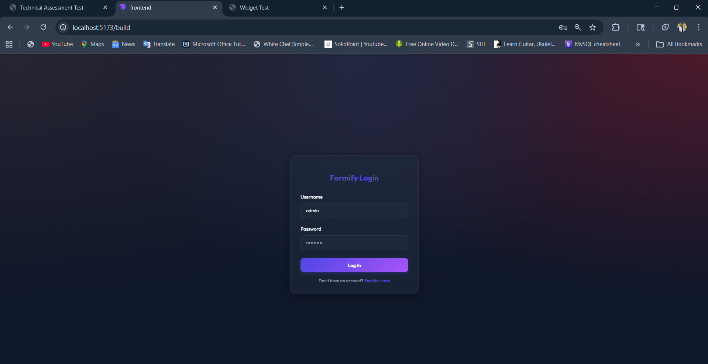
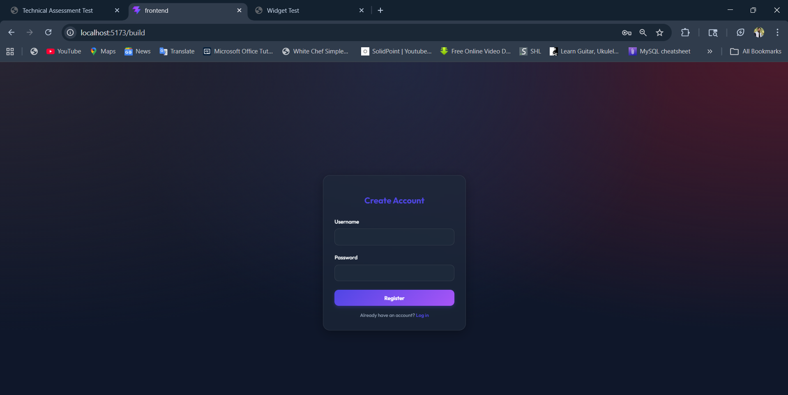
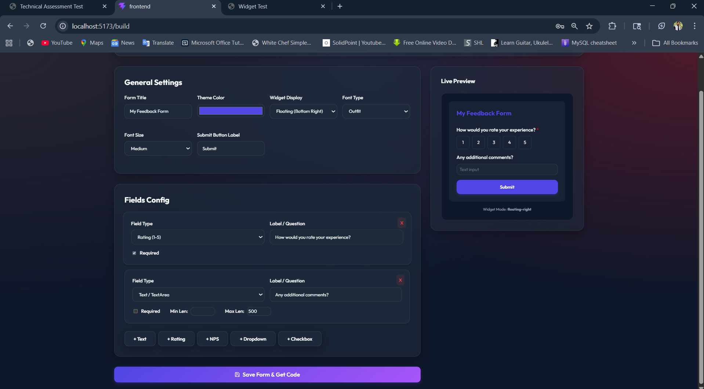
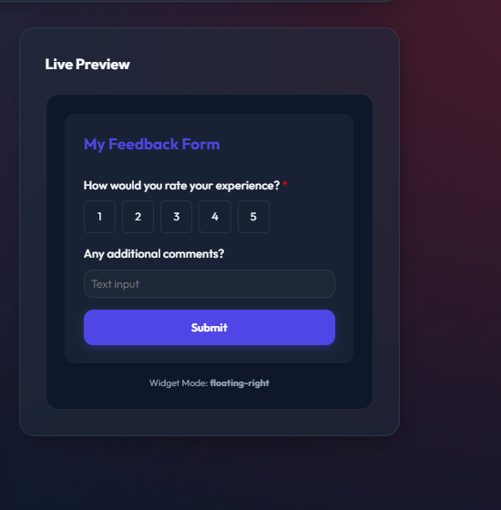
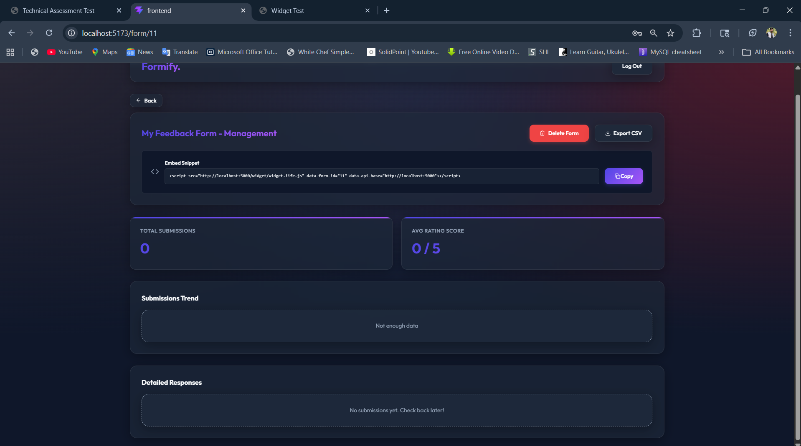
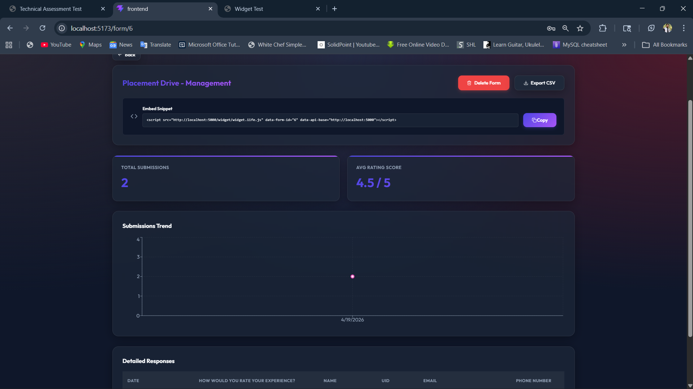
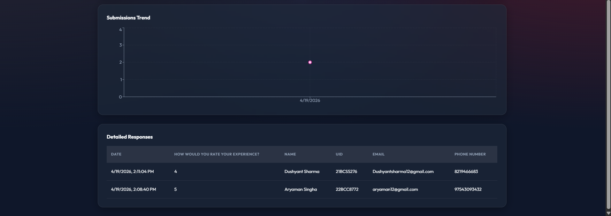

# Formify - Form & Feedback Widget Platform

A full-stack platform where users can create custom feedback forms through a React dashboard and deploy them on any website via a single `<script>` tag. Perfect for collecting user feedback, surveys, NPS responses, and more without backend complexity.

### Key Features
- 🎨 **Drag-and-drop Form Builder**: Create forms with multiple field types (text, rating, NPS, etc.)
- 🔗 **One-Line Integration**: Embed forms on any website with a single `<script>` tag
- 🎯 **CSS Isolation**: Widget uses Shadow DOM to prevent style conflicts with host websites
- 📊 **Real-time Analytics**: Dashboard with submissions data table and visual charts
- 🔐 **JWT Authentication**: Secure user accounts for dashboard access
- 📱 **Responsive Design**: Works across all devices and browsers

---

## 🛠️ 0. Technology Stack
- **Backend**: Node.js + Express + SQLite3
- **Frontend**: React 19 + Vite + React Router + Recharts + Lucide Icons
- **Widget**: Vanilla JS (Custom Element) + Shadow DOM + Vite Library Build
- **Validation**: Zod schema validation
- **Authentication**: JWT tokens

---

## 📁 1. Folder Structure & Architecture Overview
The system consists of three independent components:
```text
backend/   # Node.js + Express API + SQLite3 local database
frontend/  # Vite + React Dashboard (Vanilla CSS aesthetics)
widget/    # Vanilla JS Shadow DOM Widget (Vite Library mode)
demo/      # Standalone HTML demo for widget testing
test.html  # Local test file for widget integration
```

## 🔄 2. Data Flow (End-to-End)
1. **Form Creation**: The user logs into the dashboard, configures fields/colors, and hits save. The `frontend` sends a `POST` to the `backend` where the configuration is safely verified using Zod and stored in the SQLite `Forms` schema.
2. **Widget Embedding**: The user copies the provided `<script>` snippet and embeds it entirely into an external HTML file.
3. **Widget Fetch & Render**: The moment the external site loads, the script executes, creates a Shadow DOM mount, fetches the form configuration (`GET /api/widget/:id/config`), and renders the isolated, styled form.
4. **Submission**: The end-user fills out the form. The payload is `POST`ed, directly sending data to backend without intermediate storage, where it is safely recorded directly into the database.
5. **Dashboard Analytics**: The form creator logs back in, and the dashboard queries the backend to show data aggregated securely, including analytical visualizations and a data table.

## 🗄️ 3. Database Schema Overview
Using **SQLite3** for zero-setup portability and file-based persistence.

**Database file location**: `backend/forms.db` (created automatically on first run)

**Tables**:
- **Users**: Local user accounts with username/hashed password for dashboard authentication
- **Forms**: Form metadata including title, theme colors, position, status, webhook configuration
- **FormFields**: Field definitions linked to forms (type: text/rating/nps/email, validation rules, ordering)
- **Submissions**: JSON responses from end-users, directly bound to Forms via Foreign Keys

All tables are created automatically by `database.js` on first server startup.

## ⚙️ 4. API Endpoints Overview
- **Auth**: `/api/auth/login`, `/api/auth/register`
- **Forms (CRUD)**: `/api/forms`, `/api/forms/:id`
- **Submissions**: `/api/forms/:id/submissions`, `/api/forms/:id/export`
- **Widget**: `/api/widget/:id/config`, `/api/widget/:id/submit`

## 💻 5. Setup Prerequisites
- **Node.js**: v18 or higher
- **npm** or **yarn**: Package manager (npm comes with Node.js)
- **Git**: For cloning and version control

## 🚀 6. Quick Start Setup

### Step 1: Clone & Install Dependencies

```bash
# Clone the repository
git clone <repository-url>
cd Formify

# Backend setup
cd backend
npm install

# Frontend setup (from root)
cd ../frontend
npm install

# Widget setup (from root)
cd ../widget
npm install
```

### Step 3: Run the Backend

```bash
cd backend
npm run dev
# Server runs on http://localhost:5000
# Database auto-initializes at backend/forms.db
```

### Step 4: Run the Frontend

In a new terminal:

```bash
cd frontend
npm run dev
# Dashboard runs on http://localhost:5173
# Auto-opens browser on startup
```

### Step 6: Test the Widget Locally

Open [test.html](test.html) in your browser:

1. Ensure Backend is running (`http://localhost:5000`)
2. Ensure Widget is built (`npm run build` in `/widget`)
3. Open a simple HTTP server at the root:
   ```bash
   # Using Python 3
   python -m http.server 8080
   
   # OR using Node.js (http-server package)
   npx http-server -p 8080
   ```
4. Navigate to `http://localhost:8080/test.html`
5. The widget will load if you've created a form with ID `1` in the dashboard

---

## 🧩  7. Widget Integration Explanation
Injecting the widget to a third-party website is straightforward:
```html
<script 
  src="http://localhost:5000/widget/widget.iife.js" 
  data-form-id="1" 
  data-api-base="http://localhost:5000">
</script>
```

**How it works**: 
1. The `<script>` reads its own `data-form-id` and `data-api-base` attributes
2. It queries the backend for form configuration: `GET /api/widget/:id/config`
3. Creates a custom HTML element `<formify-widget>`
4. Renders inside a Shadow DOM for complete CSS isolation (host styles cannot affect widget styles)
5. On form submission, sends data to `POST /api/widget/:id/submit`

**Example for Production**:
```html
<!-- On your website (e.g., yoursite.com/contact) -->
<div id="feedback-widget"></div>
<script 
  src="https://your-formify-server.com/widget/widget.iife.js" 
  data-form-id="42" 
  data-api-base="https://your-formify-server.com">
</script>
```

---

## 📊 8. API Endpoints Overview
| Endpoint | Method | Auth | Purpose |
|----------|--------|------|---------|
| `/api/auth/login` | POST | No | User login with username/password |
| `/api/auth/register` | POST | No | Create new user account |
| `/api/forms` | GET | Yes | List all forms for authenticated user |
| `/api/forms` | POST | Yes | Create new form |
| `/api/forms/:id` | GET | Yes | Get single form details |
| `/api/forms/:id` | PUT | Yes | Update form settings |
| `/api/forms/:id` | DELETE | Yes | Delete form |
| `/api/forms/:id/submissions` | GET | Yes | Get all submissions for a form |
| `/api/forms/:id/export` | GET | Yes | Export submissions as CSV |
| `/api/widget/:id/config` | GET | No | Get form config (for widget) |
| `/api/widget/:id/submit` | POST | No | Submit form data (from widget) |

---

## 📸 9. Screenshots
> The screenshots below show the dashboard workflow, live preview, embed code, analytics, and submission details.

### 1. Login Screen


### 2. Register Screen


### 3. Form Builder with Live Preview


### 4. Widget Preview in the Builder


### 5. Form Management & Embed Snippet


### 6. Form Analytics and Submission Trend


### 7. Submission Detail Rows


---

## 🛡️ 10. Error Handling, Validation & Security
- **Zod Validation**: All API inputs validated using Zod schemas before processing
- **JWT Authentication**: Dashboard access protected with JWT tokens (check auth middleware)
- **CORS Protection**: Backend configured with CORS headers (currently allows all origins for development)
- **Error Responses**: Structured error responses with clear status codes
- **SQL Injection Prevention**: Parameterized queries via SQLite3

**⚠️ Production Security Notes**:
1. Change the `JWT_SECRET` value (currently defaulting to 'super-secret-key-for-formify') to a strong random string when deploying
2. Update CORS configuration to whitelist specific domains
3. Use HTTPS for all API communications
4. Implement rate limiting on public endpoints (`/api/widget/:id/submit`)
5. Add database backups strategy

---

## 🚀 11. Deployment Guide (Production)

### Backend Deployment (Example: Node.js hosting)
```bash
# Install production dependencies
npm ci --omit=dev

# On your hosting platform, set environment variables:
# - PORT=5000
# - JWT_SECRET=<your-strong-random-secret>

# Start server
npm start
```

### Widget Deployment
1. Build widget: `npm run build`
2. The output `dist/widget.iife.js` is served by the backend automatically
3. Ensure backend serves static files from `widget/dist` folder

### Frontend Deployment (Example: Vercel/Netlify)
```bash
# Build the React app
npm run build
# Output: dist/ folder ready for deployment

# Update API_BASE in src/App.jsx to production backend URL
```

### Database Backup Strategy
- SQLite database file: `backend/forms.db`
- Implement regular backups of this file to prevent data loss
- Consider migrating to PostgreSQL for high-traffic production environments

---

## 🔧 12. Troubleshooting

### Widget Not Loading
- **Issue**: Widget doesn't appear on test page
- **Solution**: 
  - Verify backend is running on port 5000
  - Check `data-form-id` matches an existing form
  - Open browser DevTools → Console for errors
  - Verify widget build exists: `widget/dist/widget.iife.js`

### CORS Errors
- **Issue**: `Access to XMLHttpRequest blocked by CORS policy`
- **Solution**: Ensure backend CORS is configured correctly for your domain

### Database Not Creating
- **Issue**: `forms.db` file not found after startup
- **Solution**: Check backend folder has write permissions, review server.js logs

### Login Failed
- **Issue**: Cannot login to dashboard
- **Solution**:
  - Register a new account first
  - Default credentials: `admin` / `password123` (change in production)

### Widget Styling Issues
- **Issue**: Widget styling conflicts with host site styles
- **Solution**: This shouldn't happen due to Shadow DOM isolation. If it does, check widget CSS files.

---

## 📚 13. Development Workflow

### Development Mode
```bash
# Terminal 1: Backend (auto-reload with --watch)
cd backend && npm run dev

# Terminal 2: Frontend (hot reload)
cd frontend && npm run dev

# Terminal 3: Widget (hot reload)
cd widget && npm run dev
```

### Building for Production
```bash
# Build widget (must be done first)
cd widget && npm run build

# Build frontend
cd frontend && npm run build

# Backend: No build needed, but minify dependencies for production
cd backend && npm ci --omit=dev
```

### Code Quality
- **ESLint**: Frontend includes ESLint configuration
  ```bash
  cd frontend && npm run lint
  ```
- **Formatting**: Use Prettier or your preferred code formatter

---

## 📄 14. File Structure Details

```
Formify/
├── backend/
│   ├── database.js          # SQLite3 schema initialization
│   ├── server.js            # Express app setup & API routes
│   ├── package.json         # Backend dependencies
│   ├── forms.db             # SQLite database (auto-created)
│   └── .env                 # Environment variables (create manually)
├── frontend/
│   ├── src/
│   │   ├── App.jsx          # Main app with routing
│   │   ├── Dashboard.jsx    # Form list & analytics
│   │   ├── FormBuilder.jsx  # Form creation UI
│   │   ├── FormDetails.jsx  # Individual form submissions
│   │   └── main.jsx         # React entry point
│   ├── package.json         # Frontend dependencies
│   ├── vite.config.js       # Vite configuration
│   └── eslint.config.js     # ESLint rules
├── widget/
│   ├── main.js              # Widget entry point (Vanilla JS)
│   ├── package.json         # Widget dependencies
│   ├── vite.config.js       # Library build config
│   └── dist/                # Built widget output (after npm run build)
├── demo/
│   └── demo.html            # Standalone demo page
├── test.html                # Local widget test file
├── README.md                # This file
└── .gitignore               # Git ignore rules
```

---

## 🤝 15. Contributing
1. Fork the repository
2. Create a feature branch: `git checkout -b feature/your-feature`
3. Commit changes: `git commit -am 'Add your feature'`
4. Push to branch: `git push origin feature/your-feature`
5. Submit a pull request

---

## 📝 16. License
This project is provided as-is for educational and commercial use.

---

## 📞 17. Support & Questions
For issues, questions, or suggestions, please open a GitHub issue or contact the development team.
- **Security Checkpoints**: Bearer Token `JWT` protects dashboard modifications natively.
- **Public API Protection**: IP-based rate limiting buffers the un-authenticated `/submit` endpoint directly averting raw API abuse.

## 🎯 9. The 4 Mandatory Self-Initiated Improvements

1. **Integrated Auto-Switching Dark Mode (Widget & Dashboard)**
   *Why/Problem Solved:* Modern platforms absolutely require Dark Mode options. The Dashboard seamlessly relies on CSS custom variable overrides. More importantly, the embedded widget intercepts `@media (prefers-color-scheme: dark)` inherently from the host website context, delivering an auto-scaled native visual experience without the dashboard needing to configure it!
2. **Advanced Form Validation Architecture**
   *Why/Problem Solved:* Unvalidated public forms gather junk data. I integrated specific rules (`min_length`, `max_length`, `is_required`) that are correctly interpreted and visually enforced via the Widget UI natively using HTML5 validation attributes mapped from the database's definitions, guaranteeing bulletproof inputs.
3. **CSV Export functionality**
   *Why/Problem Solved:* Dashboards are great for overviews, but real analysis requires deep manipulation. I added a server-rendered logical payload dump that downloads the submissions properly formatted into a CSV file based on the dynamic column keys. 
4. **IP-based Rate Limiting & Spam Prevention**
   *Why/Problem Solved:* Since the widget API doesn't require auth (it resides publicly on an embed), it's highly susceptible to botting. I implemented an in-memory Rate Limiter on the backend that locks submissions for a form per IP per minute. This stops duplicate clicks and mitigates malicious payload blasts.

## 🌩️ 10. Bonus Question Addressal

**Question**: *If we wanted to distribute this widget as an installable React component (`npm install @yourname/formwidget`), how would you approach the build setup? How would you handle the config/props model, and what SSR considerations would you keep in mind?*

**Answer**:
- **Build Setup**: I would utilize Vite library mode or Rollup to export `ESModules` and `CommonJS` formats alongside `d.ts` types via `tsc`. `react` and `react-dom` would be configured exclusively as `peerDependencies` so the host app isn't bundling double React payloads.
- **Config / Props Model**: Rather than initializing via an API call as the Vanilla JS script does, the React component would inherently take direct props: `<FormifyWidget formId="123" position="floating" onSuccess={(data)=>...} />`. The `onSuccess` callback becomes a native pipeline for host apps instead of Webhooks!
- **SSR Considerations**: Since the component inherently binds state and dynamically calculates DOM styles based on user interactions, it has to function client-side. In modern frameworks like Next.js, this means strictly adding the `"use client"` directive at the top of the component and ensuring `typeof window !== 'undefined'` before accessing `document` or `localStorage`.

---

## 🛑 11. Limitations & Known Issues
- **Limited Scale**: Native SQLite limits extremely high throughput vertical scaling dynamically across horizontal instances. Migration to PostgreSQL is necessary at peak scale.
- **Webhook Simplicity**: Provides a basic one-shot POST operation. Under heavy architectural scale, no-retry webhooks drop mission-critical actions if external destinations are down.
- **Known issue**: The widget presently requires correct/existent `formId`, otherwise it mounts a simple red error box.

## ⛴️ 12. Deployment Notes
- This monorepo breaks neatly into modern environments quickly.
- Backend can be easily dockerized or dropped onto **Render**.
- Frontend compiles cleanly statically and shifts entirely properly onto **Vercel** or **Netlify**.
